# GWCert — 证书管理工具

GWCert 是一款基于 **Qt 6 + OpenSSL** 的图形化证书管理工具，旨在简化 PKI（公钥基础设施）的日常管理工作。它提供完整的 PKI 目录结构管理、CA 证书签发、CSR 生成与签署、证书查看验证等功能。

## 界面预览

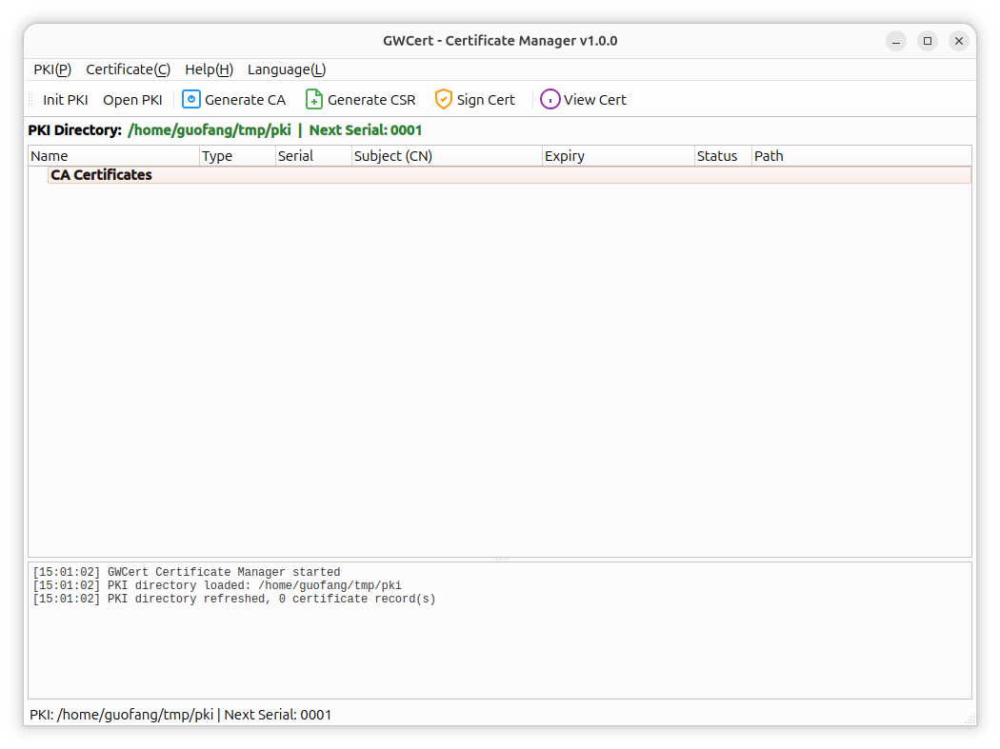

## 功能概览

- 初始化和管理标准 PKI 目录结构
- 生成自签名 CA 根证书（支持 RSA / EC 密钥）
- 生成证书签名请求（CSR），支持 SAN 扩展
- 签署中间 CA 证书和服务证书
- 自动分配和管理证书序列号
- 维护证书数据库（index.txt）
- 查看证书 / CSR 详细信息
- 验证证书链
- 导出 PKCS#12 格式
- 导出证书文件到指定目录
- 合并证书为证书链（fullchain）
- 中英文双语界面

## PKI 目录结构

```
pki/
├── ca/                     # CA 证书
│   ├── ca.crt              # 根 CA 证书
│   └── private/
│       └── ca.key          # 根 CA 私钥
├── intermediate/           # 中间 CA 证书
│   └── private/            # 中间 CA 私钥
├── certs/                  # 已签发的终端证书（按序列号命名）
├── newcerts/               # 证书归档副本
├── csr/                    # 证书签名请求
├── private/                # 终端实体私钥
├── crl/                    # 证书吊销列表
├── serial                  # 下一个可用序列号（十六进制）
├── index.txt               # 证书数据库
└── index.txt.attr          # 数据库属性
```

## 编译

### 依赖

- CMake ≥ 3.21
- Qt 6（Core, Gui, Widgets, LinguistTools）
- OpenSSL
- C++17 编译器

### 构建步骤

```bash
cmake --preset linux-debug
cmake --build out/build/linux-debug
```

## GitHub Release 自动发布

仓库已配置 GitHub Actions 工作流 [`.github/workflows/release.yml`](.github/workflows/release.yml)：

- 当推送符合 `v*` 的 tag（如 `v1.0.0`）时，会自动执行构建、测试、安装、打包
- 发布环境为 `windows-latest`，使用 `MSVC 2022 x64` 编译
- 打包结果会上传到 GitHub Release，文件名格式为 `gwcert-<tag>-windows-x64-msvc.zip`

示例：

```bash
git tag v1.0.0
git push origin v1.0.0
```

---

## CA 管理者

CA 管理者负责建立和维护整个 PKI 基础设施，包括初始化目录、生成根证书、审核并签署证书请求。

### 1. 初始化 PKI 目录

首次使用时，需要创建 PKI 目录结构：

1. 菜单 **PKI → 初始化 PKI 目录** 或点击工具栏 **Init PKI**

   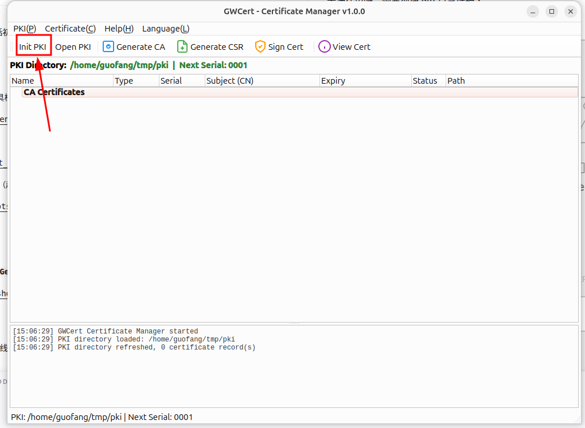

2. 选择一个空目录（或确认在非空目录中初始化）

   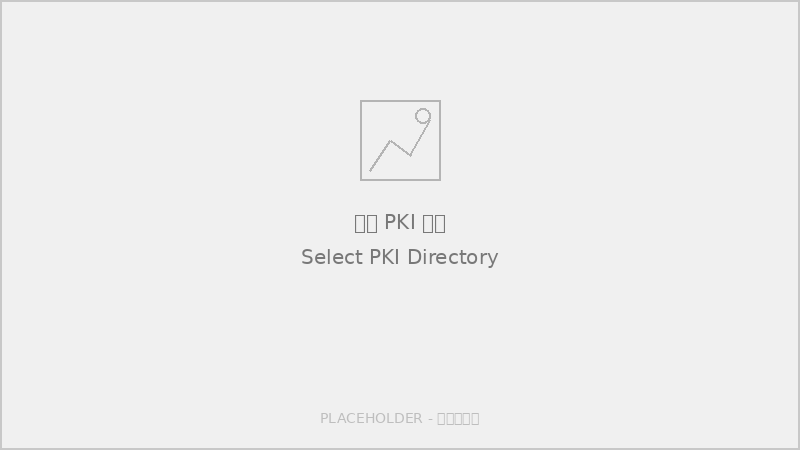

3. 程序自动创建上述目录结构，并生成 `serial`（起始值 0001）、`index.txt` 等种子文件

   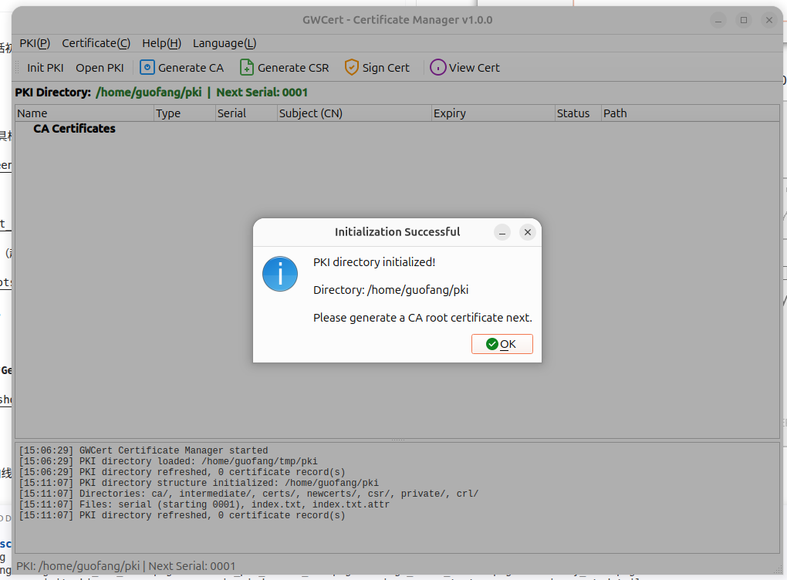

之后每次启动程序会自动加载上次使用的 PKI 目录。

### 2. 生成 CA 根证书

1. 菜单 **证书 → 生成 CA 证书** 或工具栏 **Generate CA**

   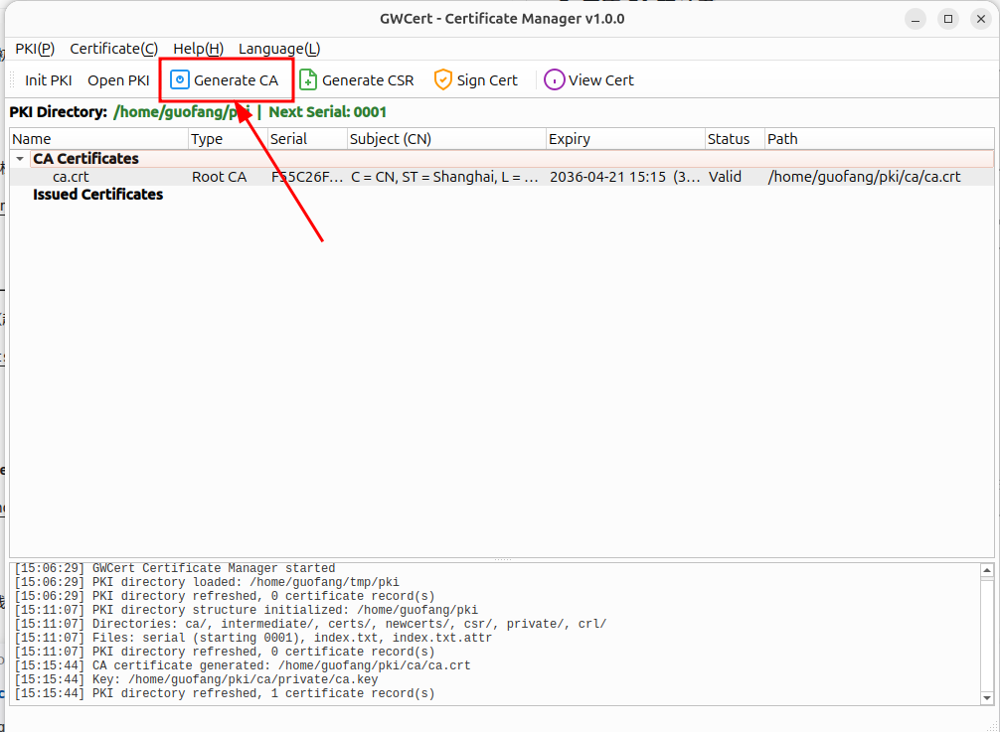

2. 填写证书主题信息（CN、O、OU、C、ST、L）
3. 选择密钥类型和参数：
   - **RSA**：2048 / 3072 / 4096 位
   - **EC**：prime256v1 / secp384r1 等曲线
4. 设置有效期（默认 3650 天，即 10 年）
5. 可选设置 CA 私钥密码
6. 点击生成

   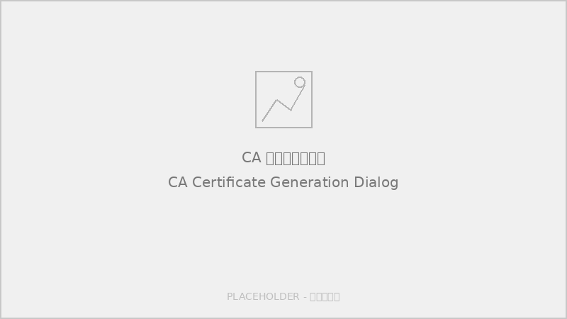

生成的文件：
- `ca/ca.crt` — 根 CA 证书
- `ca/private/ca.key` — 根 CA 私钥（需妥善保管）

CA 根证书会自动以序列号 `00` 记录到 `index.txt` 数据库中。

### 3. 签署证书请求

当收到服务器管理员提交的 CSR 文件后：

1. 将 CSR 文件放入 PKI 目录的 `csr/` 子目录
2. 在证书树中找到该 CSR，**右键 → 签署此 CSR**（或通过菜单 **证书 → 签署证书**）

   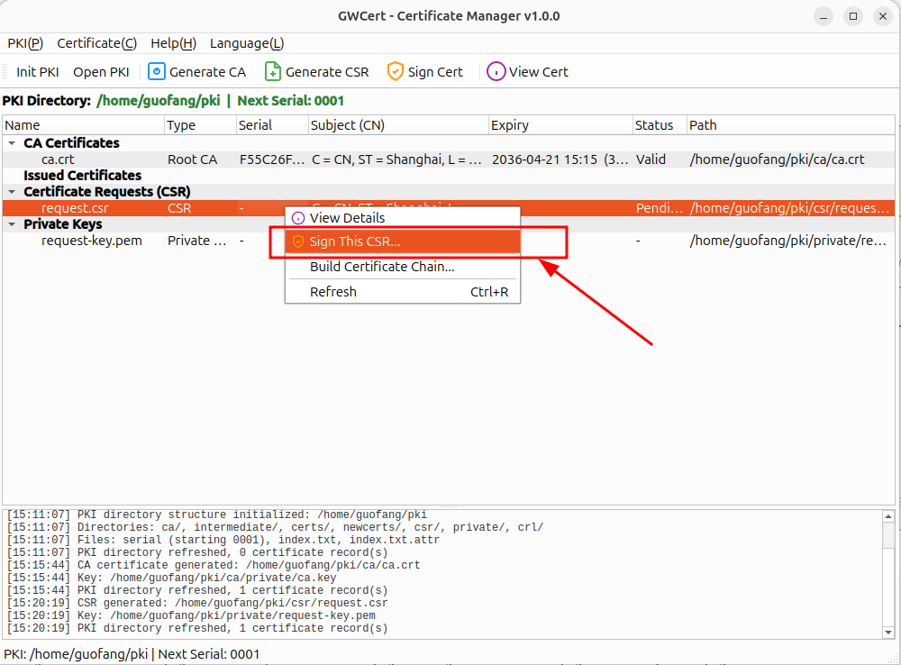

3. 在签署对话框中：
   - CSR 文件路径已自动填入（右键菜单方式）
   - CA 证书和 CA 私钥路径自动从 PKI 目录加载
   - 输入 CA 私钥密码（如有）
   - 设置证书有效期
   - 如果是中间 CA，勾选 **签署为 CA 证书**，并可设置路径长度约束
   - 可覆盖 SAN（留空则使用 CSR 中的 SAN）
   - 设置输出证书路径

   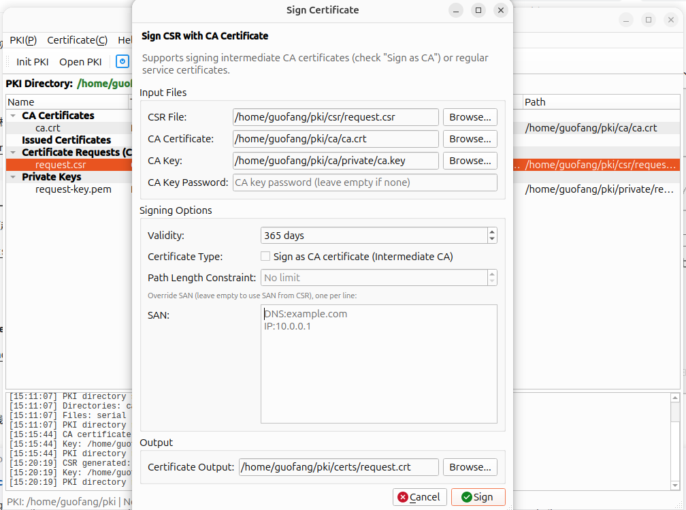

4. 点击 **签署**

签署完成后：
- 自动分配序列号（从 `serial` 文件读取并递增）
- 证书副本自动保存到 `newcerts/<序列号>.pem` 和 `certs/<序列号>.pem`
- `index.txt` 数据库自动更新

### 4. 管理证书数据库

- 菜单 **PKI → 查看证书数据库** 可查看所有已签发证书的状态、序列号、主题、过期时间等

  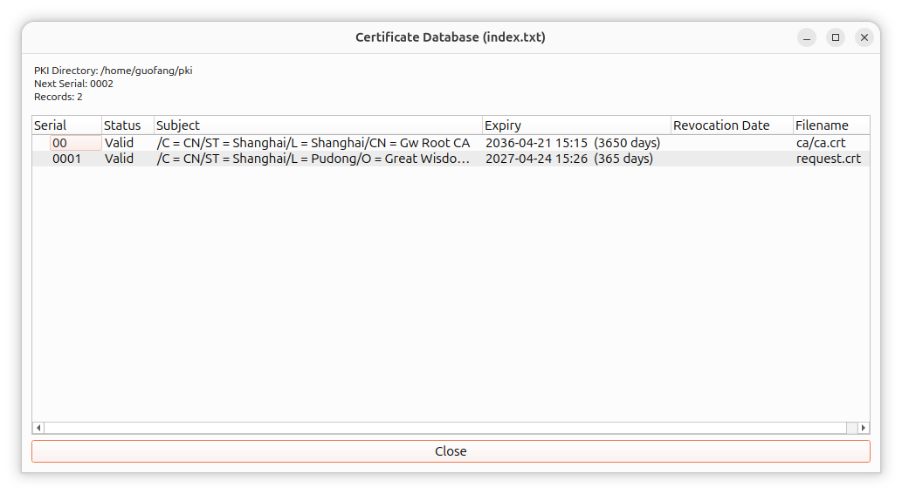

- 证书树主视图以颜色标识到期状态：
  - **红色**：已过期
  - **深橙色**：30 天内到期
  - **琥珀色**：90 天内到期

  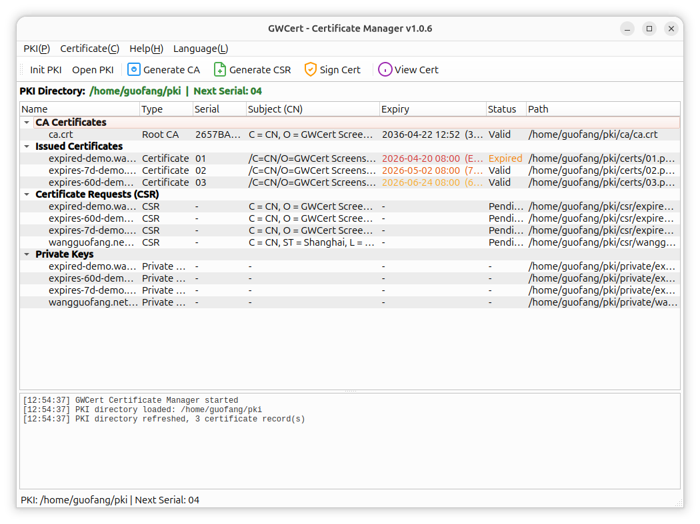

### 5. 验证证书

右键点击已签发的证书 → **验证证书**，选择 CA 证书进行链式验证。

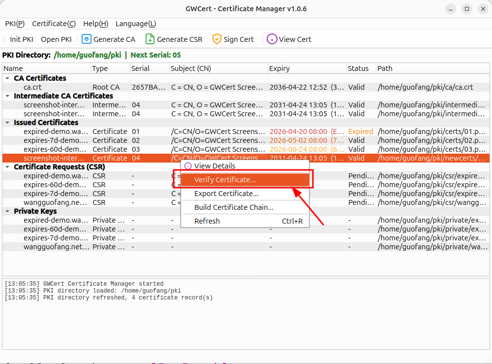

### 6. 导出证书

右键点击证书 → **导出证书**，选择目标目录，证书将以 `index.txt` 中记录的文件名导出（而非序列号文件名），便于分发给服务器管理员。

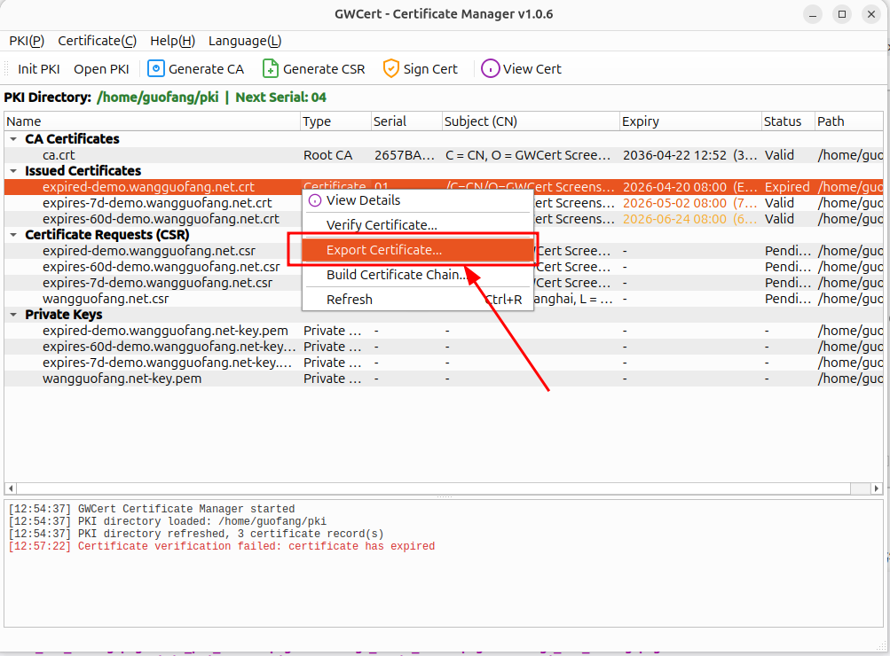

### 7. 合并证书链

当使用了中间 CA 时，服务器管理员通常需要一个包含完整证书链的文件。CA 管理者可以提前合并好证书链：

1. 菜单 **证书 → 合并证书链** 或在证书树右键 → **合并证书链**
2. 在文件选择对话框中，按顺序选择要合并的证书文件（如先选中间 CA 证书，再选根 CA 证书）

   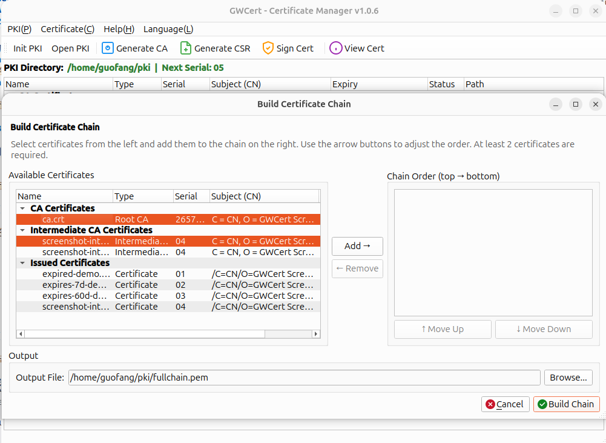

3. 确认合并顺序

   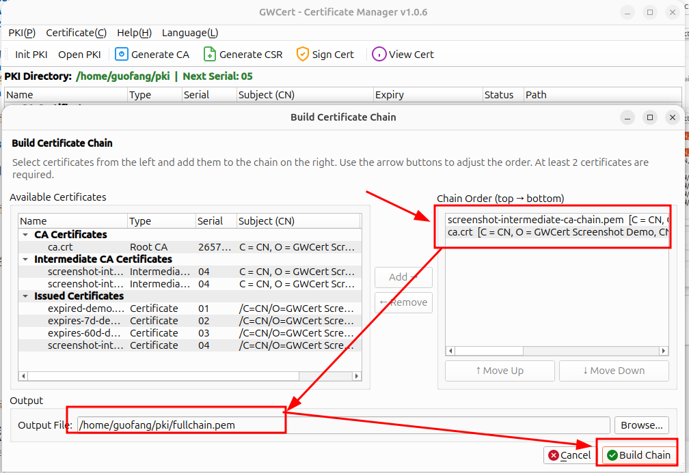

4. 选择输出路径（默认 `fullchain.pem`）

合并后的证书链文件可以直接用于服务部署。常见的合并顺序：
- **服务证书 + 中间 CA + 根 CA** — 完整链
- **中间 CA + 根 CA** — CA 链（由服务器管理员自行拼接服务证书）

---

## 服务器管理员

服务器管理员负责为自己的服务生成密钥和证书请求，提交给 CA 管理者签署后，将签发的证书部署到服务中。

### 1. 生成 CSR（证书签名请求）

1. 菜单 **证书 → 生成 CSR** 或工具栏 **Generate CSR**

   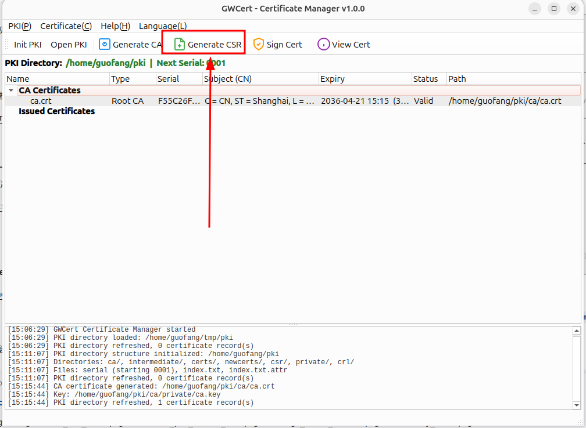

2. 填写证书主题信息：
   - **CN（通用名称）**：填写服务域名，如 `www.example.com`
   - **O（组织）**、**OU（部门）** 等根据需要填写
3. 填写 **SAN（主题备用名称）**，每行一条，支持格式：
   ```
   DNS:example.com
   DNS:*.example.com
   IP:10.0.0.1
   IP:192.168.1.100
   ```
4. 选择密钥类型和参数（RSA 2048 或 EC prime256v1 等）
5. 可选加密私钥（设置密码）
6. 设置 CSR 和私钥的输出路径
7. 点击生成

   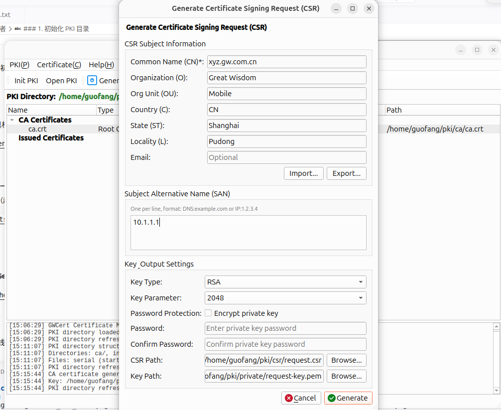

生成的文件：
- `csr/<名称>.csr` — 证书签名请求（**提交给 CA 管理者**）
- `private/<名称>-key.pem` — 私钥（**自行保管，切勿泄露**）

### 2. 提交 CSR 给 CA 管理者

将生成的 `.csr` 文件通过安全渠道发送给 CA 管理者，等待签署。CSR 中不包含私钥信息，可以安全传输。

### 3. 获取签发的证书

CA 管理者签署后会返回证书文件（`.crt` / `.pem`）。

### 4. 部署证书到服务

以 Nginx 为例：

```nginx
server {
    listen 443 ssl;
    server_name example.com;

    ssl_certificate     /etc/nginx/ssl/fullchain.pem;     # 证书链文件
    ssl_certificate_key /etc/nginx/ssl/example.com.key;   # 自己的私钥
}
```

如果 CA 管理者提供的是单独的服务证书和 CA 链文件，可使用 GWCert 的 **合并证书链** 功能将它们合并：

1. 菜单 **证书 → 合并证书链**
2. 依次选择：服务证书 → 中间 CA 证书 → 根 CA 证书
3. 保存为 `fullchain.pem`

也可以在命令行中手动拼接：
```bash
cat server.crt intermediate.crt root.crt > fullchain.pem
```

### 5. 查看和验证证书

- **查看证书**：双击证书树中的任意证书/CSR，或右键 → **查看详情**，可查看主题、签发者、有效期、SAN、指纹等完整信息

  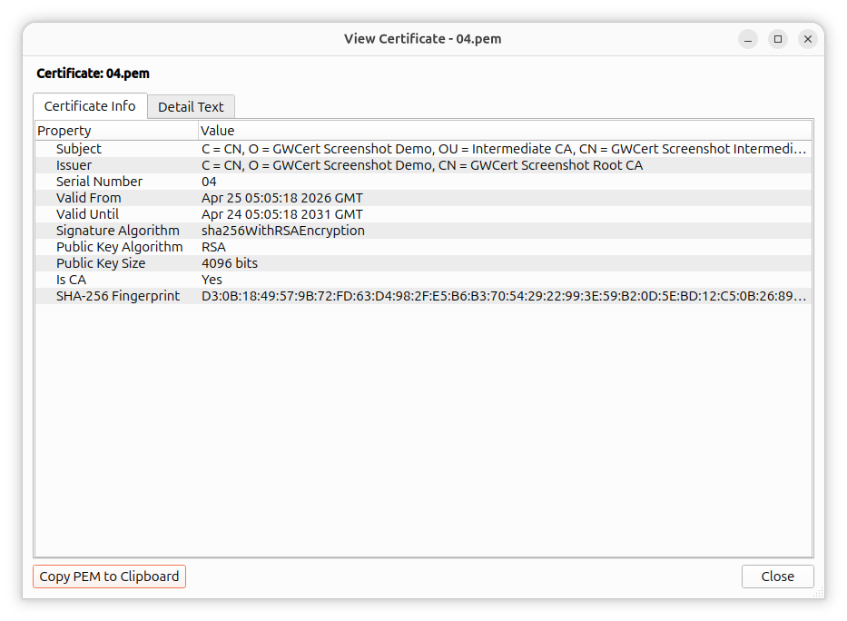

- **验证证书**：菜单 **证书 → 验证证书** 或右键 → **验证证书**，选择 CA 证书进行链式验证，确认证书有效

### 6. 导出 PKCS#12

如果服务需要 PKCS#12 格式（如 Java KeyStore、Windows IIS）：

1. 菜单 **证书 → 导出 PKCS#12**
2. 选择证书文件和对应的私钥文件
3. 设置导出密码
4. 选择 `.p12` 输出路径

   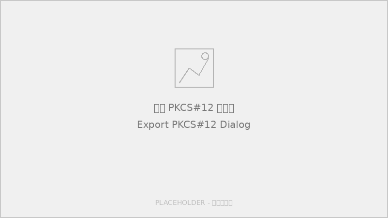

---

## 典型工作流程

```
┌─────────────────┐                           ┌─────────────────┐
│   CA 管理者      │                           │   服务器管理员      │
├─────────────────┤                           ├─────────────────┤
│                 │                           │                 │
│  1. 初始化 PKI   │                           │  1. 生成 CSR     │
│  2. 生成 CA 根证书│                           │     + 私钥       │
│                 │         提交 CSR           │                 │
│  3. 收到 CSR ◄───┼───────────────────────────┤  2. 发送 .csr    │
│  4. 审核并签署    │                           │                 │
│                 │         返回证书            │                 │
│  5. 发送证书 ────┼──────────────────────────►│  3. 收到 .crt    │
│  6. 合并证书链    │                           │  4. 合并证书链    │
│                 │         返回证书链          │  5. 部署到服务    │
│  7. 更新数据库    │                           │                 │
└─────────────────┘                           └─────────────────┘
```

## 许可证

GWCert 使用 Qt 6 和 OpenSSL 构建。请遵循各组件的许可协议。
